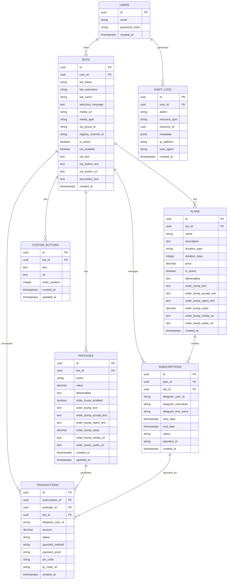

# 🗄️ Estrutura do Banco de Dados - DINOBOT

## 📋 Visão Geral do Sistema

O **DINOBOT** é uma plataforma SaaS completa para gerenciar grupos VIP do Telegram com assinaturas automatizadas, pagamentos PIX e controle de membros. O sistema permite que usuários criem e gerenciem múltiplos bots Telegram, configurem planos de assinatura, processem pagamentos e automatizem o controle de acesso aos grupos VIP.

### Características Principais:
- **Multi-tenant**: Cada usuário gerencia seus próprios bots isoladamente
- **Monetização**: Planos de assinatura e pacotes de compra única
- **Automação**: Adição/remoção automática de usuários nos grupos
- **Pagamentos**: Integração com múltiplos gateways PIX
- **Segurança**: Row Level Security (RLS) em todas as tabelas

---

## 🏗️ Arquitetura do Banco de Dados

### Schema Completo
O banco de dados utiliza **PostgreSQL** via **Supabase** com 7 tabelas principais:



### Índices de Performance
O sistema possui **15 índices** otimizados para consultas frequentes:

```sql
-- Índices principais
idx_bots_user_id                    -- Bots por usuário
idx_bots_is_active                  -- Bots ativos
idx_plans_bot_id                    -- Planos por bot
idx_packages_bot_id                 -- Pacotes por bot
idx_custom_buttons_bot_id           -- Botões por bot
idx_subscriptions_bot_id            -- Assinaturas por bot
idx_subscriptions_status            -- Status das assinaturas
idx_subscriptions_telegram_user_id  -- Usuário Telegram
idx_transactions_bot_id             -- Transações por bot
idx_transactions_status             -- Status das transações
idx_transactions_created_at         -- Ordenação temporal
idx_transactions_package_id         -- Transações por pacote
idx_audit_logs_user_id              -- Logs por usuário
idx_audit_logs_created_at           -- Logs temporais
idx_custom_buttons_order            -- Ordem dos botões
```

---

## 📊 Detalhamento das Tabelas

### 1. 🤖 Tabela `bots`
**Propósito**: Configuração e gerenciamento dos bots Telegram

| Campo | Tipo | Constraints | Descrição |
|-------|------|-------------|-----------|
| `id` | uuid | PRIMARY KEY, DEFAULT gen_random_uuid() | Identificador único do bot |
| `user_id` | uuid | NOT NULL, FK → auth.users(id) ON DELETE CASCADE | Proprietário do bot |
| `bot_token` | text | NOT NULL | Token do bot obtido via @BotFather |
| `bot_username` | text | NOT NULL | Username do bot (sem @) |
| `bot_name` | text | NOT NULL | Nome de exibição do bot |
| `welcome_message` | text | NOT NULL, DEFAULT 'Olá {profile_name}! 👋' | Mensagem de boas-vindas |
| `media_url` | text | NULL | URL da mídia de boas-vindas |
| `media_type` | text | CHECK IN ('image', 'video') | Tipo da mídia |
| `vip_group_id` | text | NOT NULL | ID do grupo VIP no Telegram |
| `vip_group_link` | text | NULL | Link de convite do grupo |
| `registry_channel_id` | text | NOT NULL | Canal para notificações de vendas |
| `webhook_url` | text | NULL | URL do webhook configurado |
| `is_active` | boolean | NOT NULL, DEFAULT false | Status de ativação do bot |
| `cta_enabled` | boolean | DEFAULT false | Habilitar botão CTA |
| `cta_text` | text | NULL | Texto antes do botão CTA |
| `cta_button_text` | text | NULL | Texto do botão CTA |
| `cta_button_url` | text | NULL | URL do botão CTA (opcional) |
| `secondary_text` | text | NULL | Texto secundário após mídia |
| `payment_enabled` | boolean | DEFAULT false | Habilitar pagamentos |
| `payment_gateway` | text | CHECK IN ('pushinpay', 'syncpay', 'mercadopago', 'asaas') | Gateway de pagamento |
| `payment_method_message` | text | NULL | Mensagem personalizada de pagamento |
| `pix_media_url` | text | NULL | Mídia na tela de PIX |
| `pix_media_type` | text | CHECK IN ('image', 'video') | Tipo da mídia PIX |
| `pix_audio_url` | text | NULL | Áudio na tela de PIX |
| `pix_format_blockquote` | boolean | DEFAULT false | Formato do código PIX |
| `show_qrcode_in_chat` | boolean | DEFAULT true | Mostrar QR Code no chat |
| `created_at` | timestamptz | NOT NULL, DEFAULT now() | Data de criação |

**Funcionalidades Suportadas**:
- Configuração completa do fluxo do bot
- Personalização de mensagens com variáveis
- Upload de mídia para boas-vindas e PIX
- Configuração de Call-to-Action (CTA)
- Integração com múltiplos gateways de pagamento

### 2. 📋 Tabela `plans`
**Propósito**: Planos de assinatura recorrente

| Campo | Tipo | Constraints | Descrição |
|-------|------|-------------|-----------|
| `id` | uuid | PRIMARY KEY, DEFAULT gen_random_uuid() | Identificador único do plano |
| `bot_id` | uuid | NOT NULL, FK → bots(id) ON DELETE CASCADE | Bot associado |
| `name` | text | NOT NULL | Nome do plano (ex: "VIP Semanal") |
| `description` | text | NULL | Descrição detalhada |
| `duration_type` | text | NOT NULL, CHECK IN ('WEEKLY', 'MONTHLY', 'LIFETIME') | Tipo de duração |
| `duration_days` | integer | CHECK (> 0 OR NULL) | Duração em dias (NULL para LIFETIME) |
| `price` | decimal(10,2) | NOT NULL, CHECK (>= 0) | Preço do plano |
| `is_active` | boolean | NOT NULL, DEFAULT true | Plano disponível para venda |
| `deliverables` | text | NULL | Links/conteúdo entregue ao cliente |
| `order_bump_text` | text | NULL | Texto da oferta especial |
| `order_bump_accept_text` | text | DEFAULT 'Aceitar' | Texto do botão aceitar |
| `order_bump_reject_text` | text | DEFAULT 'Recusar' | Texto do botão recusar |
| `order_bump_value` | decimal(10,2) | CHECK (>= 0) | Valor da oferta especial |
| `order_bump_media_url` | text | NULL | Mídia da oferta especial |
| `order_bump_audio_url` | text | NULL | Áudio da oferta especial |
| `created_at` | timestamptz | NOT NULL, DEFAULT now() | Data de criação |

**Funcionalidades Suportadas**:
- Planos semanais, mensais e vitalícios
- Sistema de Order Bump (upsell)
- Deliverables personalizáveis
- Mídia e áudio para ofertas especiais

### 3. 📦 Tabela `packages`
**Propósito**: Pacotes de compra única (sem recorrência)

| Campo | Tipo | Constraints | Descrição |
|-------|------|-------------|-----------|
| `id` | uuid | PRIMARY KEY, DEFAULT gen_random_uuid() | Identificador único do pacote |
| `bot_id` | uuid | NOT NULL, FK → bots(id) ON DELETE CASCADE | Bot associado |
| `name` | text | NOT NULL | Nome do pacote |
| `value` | decimal(10,2) | NOT NULL, CHECK (>= 0) | Valor do pacote |
| `deliverables` | text | NOT NULL | Links/conteúdo entregue (obrigatório) |
| `order_bump_enabled` | boolean | DEFAULT false | Habilitar oferta especial |
| `order_bump_text` | text | NULL | Texto da oferta especial |
| `order_bump_accept_text` | text | DEFAULT 'Aceitar' | Texto do botão aceitar |
| `order_bump_reject_text` | text | DEFAULT 'Recusar' | Texto do botão recusar |
| `order_bump_value` | decimal(10,2) | CHECK (>= 0) | Valor da oferta especial |
| `order_bump_media_url` | text | NULL | Mídia da oferta especial |
| `order_bump_audio_url` | text | NULL | Áudio da oferta especial |
| `created_at` | timestamptz | DEFAULT now() | Data de criação |
| `updated_at` | timestamptz | DEFAULT now() | Última atualização |

**Funcionalidades Suportadas**:
- Compras únicas sem recorrência
- Deliverables obrigatórios
- Sistema de Order Bump opcional
- Trigger automático para updated_at

### 4. 🔘 Tabela `custom_buttons`
**Propósito**: Botões personalizados nos bots

| Campo | Tipo | Constraints | Descrição |
|-------|------|-------------|-----------|
| `id` | uuid | PRIMARY KEY, DEFAULT gen_random_uuid() | Identificador único do botão |
| `bot_id` | uuid | NOT NULL, FK → bots(id) ON DELETE CASCADE | Bot associado |
| `text` | text | NOT NULL | Texto exibido no botão |
| `url` | text | NOT NULL | URL de destino |
| `order_position` | integer | NOT NULL, DEFAULT 0 | Posição na ordem de exibição |
| `created_at` | timestamptz | NOT NULL, DEFAULT now() | Data de criação |
| `updated_at` | timestamptz | NOT NULL, DEFAULT now() | Última atualização |

**Funcionalidades Suportadas**:
- Botões com links externos
- Ordenação configurável
- Integração com fluxo do bot
- Trigger automático para updated_at

### 5. 👥 Tabela `subscriptions`
**Propósito**: Assinaturas ativas e históricas dos usuários

| Campo | Tipo | Constraints | Descrição |
|-------|------|-------------|-----------|
| `id` | uuid | PRIMARY KEY, DEFAULT gen_random_uuid() | Identificador único da assinatura |
| `plan_id` | uuid | NOT NULL, FK → plans(id) ON DELETE CASCADE | Plano associado |
| `bot_id` | uuid | NOT NULL, FK → bots(id) ON DELETE CASCADE | Bot associado |
| `telegram_user_id` | text | NOT NULL | ID do usuário no Telegram |
| `telegram_username` | text | NULL | Username do usuário (@username) |
| `telegram_first_name` | text | NULL | Primeiro nome do usuário |
| `start_date` | timestamptz | NOT NULL, DEFAULT now() | Início da assinatura |
| `end_date` | timestamptz | NULL | Fim da assinatura (NULL para LIFETIME) |
| `status` | text | NOT NULL, CHECK IN ('ACTIVE', 'EXPIRED', 'CANCELLED') | Status da assinatura |
| `payment_id` | text | NULL | Referência do pagamento |
| `created_at` | timestamptz | NOT NULL, DEFAULT now() | Data de criação |

**Funcionalidades Suportadas**:
- Controle de assinaturas ativas/expiradas
- Cálculo automático de datas de expiração
- Integração com sistema de pagamentos
- Suporte a assinaturas vitalícias

### 6. 💳 Tabela `transactions`
**Propósito**: Histórico completo de transações de pagamento

| Campo | Tipo | Constraints | Descrição |
|-------|------|-------------|-----------|
| `id` | uuid | PRIMARY KEY, DEFAULT gen_random_uuid() | Identificador único da transação |
| `subscription_id` | uuid | FK → subscriptions(id) ON DELETE SET NULL | Assinatura gerada (para planos) |
| `package_id` | uuid | FK → packages(id) ON DELETE CASCADE | Pacote comprado (para pacotes) |
| `bot_id` | uuid | NOT NULL, FK → bots(id) ON DELETE CASCADE | Bot associado |
| `telegram_user_id` | text | NOT NULL | ID do comprador no Telegram |
| `amount` | decimal(10,2) | NOT NULL, CHECK (>= 0) | Valor da transação |
| `status` | text | NOT NULL, CHECK IN ('PENDING', 'COMPLETED', 'FAILED', 'REFUNDED') | Status do pagamento |
| `payment_method` | text | NULL | Método de pagamento utilizado |
| `payment_proof` | text | NULL | Comprovante/referência do pagamento |
| `pix_code` | text | NULL | Código PIX gerado |
| `qr_code_url` | text | NULL | URL do QR Code |
| `created_at` | timestamptz | NOT NULL, DEFAULT now() | Data de criação |

**Funcionalidades Suportadas**:
- Rastreamento completo de pagamentos
- Suporte a planos e pacotes
- Integração com gateways PIX
- Geração de códigos PIX e QR Codes

### 7. 📝 Tabela `audit_logs`
**Propósito**: Logs de auditoria para rastreamento de ações

| Campo | Tipo | Constraints | Descrição |
|-------|------|-------------|-----------|
| `id` | uuid | PRIMARY KEY, DEFAULT gen_random_uuid() | Identificador único do log |
| `user_id` | uuid | FK → auth.users(id) ON DELETE SET NULL | Usuário que executou a ação |
| `action` | text | NOT NULL | Ação executada (ex: CREATE_BOT, DELETE_PLAN) |
| `resource_type` | text | NOT NULL | Tipo de recurso afetado |
| `resource_id` | uuid | NULL | ID do recurso afetado |
| `metadata` | jsonb | DEFAULT '{}' | Contexto adicional em JSON |
| `ip_address` | text | NULL | Endereço IP do usuário |
| `user_agent` | text | NULL | User agent do navegador |
| `created_at` | timestamptz | DEFAULT now() | Data da ação |

**Funcionalidades Suportadas**:
- Rastreamento de todas as ações críticas
- Contexto detalhado em JSON
- Informações de segurança (IP, User Agent)
- Compliance e debugging

---

## 🔒 Políticas de Segurança (RLS)

### Row Level Security (RLS)
Todas as tabelas possuem RLS ativo com políticas otimizadas:

#### Padrão de Segurança:
```sql
-- Usuários só acessam dados de seus próprios bots
USING (
  EXISTS (
    SELECT 1 FROM bots
    WHERE bots.id = [table].bot_id
    AND bots.user_id = auth.uid()
  )
)
```

#### Políticas por Tabela:

**bots**:
- ✅ Users can view own bots
- ✅ Users can insert own bots  
- ✅ Users can update own bots
- ✅ Users can delete own bots

**plans**:
- ✅ Users can view plans for own bots
- ✅ Users can insert plans for own bots
- ✅ Users can update plans for own bots
- ✅ Users can delete plans for own bots

**packages**:
- ✅ Users can read own bot packages
- ✅ Users can insert packages for own bots
- ✅ Users can update own bot packages
- ✅ Users can delete own bot packages

**custom_buttons**:
- ✅ Users can view buttons from their own bots
- ✅ Users can insert buttons to their own bots
- ✅ Users can update buttons from their own bots
- ✅ Users can delete buttons from their own bots

**subscriptions**:
- ✅ Users can view subscriptions for own bots
- ✅ Users can insert subscriptions for own bots
- ✅ Users can update subscriptions for own bots
- ✅ Users can delete subscriptions for own bots

**transactions**:
- ✅ Users can view transactions for own bots
- ✅ Users can insert transactions for own bots
- ✅ Users can update transactions for own bots
- ✅ Users can delete transactions for own bots

**audit_logs**:
- ✅ Users can view own audit logs
- ✅ Service role can insert audit logs (para Edge Functions)

---

## 📋 Migrações Aplicadas

O sistema possui **16 migrações SQL** aplicadas sequencialmente:

| Migração | Arquivo | Descrição |
|----------|---------|-----------|
| 1 | `20251013211840_create_apexvips_schema.sql` | Schema inicial com 4 tabelas base |
| 2 | `20251013215841_fix_plans_insert_policy.sql` | Correção de políticas de inserção |
| 3 | `20251013222950_setup_cron_jobs.sql` | Configuração de jobs automáticos |
| 4 | `20251013223604_add_payment_gateway_to_bots.sql` | Campos de gateway de pagamento |
| 5 | `20251013225003_add_performance_indexes_and_audit_logs.sql` | Índices e tabela audit_logs |
| 6 | `20251013234638_add_payment_customization_fields.sql` | Campos de personalização PIX |
| 7 | `20251013234658_add_pix_fields_to_transactions.sql` | Campos PIX nas transações |
| 8 | `20251013235444_fix_security_and_performance_issues.sql` | Otimizações de segurança |
| 9 | `20251014001447_fix_remaining_security_issues.sql` | Correções finais de segurança |
| 10 | `20251014001945_remove_unused_indexes_and_adjust_policies.sql` | Limpeza de índices |
| 11 | `20251014002334_fix_final_security_issues.sql` | Políticas finais de segurança |
| 12 | `20251014030000_add_cta_button_to_bots.sql` | Campos de Call-to-Action |
| 13 | `20251014040000_add_order_bump_fields_to_plans.sql` | Campos de Order Bump em planos |
| 14 | `20251014050000_create_packages_table.sql` | Tabela de pacotes |
| 15 | `20251014060000_create_custom_buttons_table.sql` | Tabela de botões personalizados |
| 16 | `20251014070000_add_package_id_to_transactions.sql` | Referência de pacotes em transações |

---

## ⚡ Funcionalidades Suportadas

### 🤖 Gerenciamento de Bots
- **Configuração completa**: Token, username, grupos VIP
- **Personalização**: Mensagens, mídia, CTA, botões personalizados
- **Fluxo customizável**: Mídia → Texto → CTA → Planos → PIX
- **Webhook**: Configuração automática para receber updates

### 💰 Monetização
- **Planos de assinatura**: Semanal, mensal, vitalício
- **Pacotes únicos**: Compra sem recorrência
- **Order Bump**: Sistema de upsell com mídia
- **Deliverables**: Links/conteúdo entregue automaticamente

### 💳 Pagamentos PIX
- **4 Gateways**: PushinPay, Syncpay, Mercado Pago, Asaas
- **Geração automática**: Código PIX e QR Code
- **Personalização**: Mídia, áudio, formato do código
- **Rastreamento**: Status completo das transações

### 🔄 Automações
- **Adição automática**: Usuários pagos entram no grupo VIP
- **Notificações**: Avisos 3 dias antes da expiração
- **Remoção automática**: Usuários expirados saem do grupo
- **Logs detalhados**: Todas as operações registradas

### 📊 Analytics
- **Dashboard**: Métricas em tempo real
- **Receita**: Total e por bot
- **Conversão**: Taxa de vendas
- **Histórico**: Transações e assinaturas

---

## 🔗 Integrações

### 📱 Telegram API
- **Bot Management**: Criação e configuração via @BotFather
- **Webhook**: Recebimento de mensagens e callbacks
- **Group Management**: Adição/remoção automática de membros
- **Media Support**: Envio de imagens, vídeos e áudios

### 💳 Gateways de Pagamento PIX
- **PushinPay**: Integração via API REST
- **Syncpay**: Geração de PIX e webhooks
- **Mercado Pago**: API oficial do MP
- **Asaas**: Gateway nacional

### ⚡ Edge Functions (Supabase)
- **telegram-webhook**: Processa updates do Telegram
- **generate-pix**: Gera códigos PIX e QR Codes
- **confirm-payment**: Confirma pagamentos via webhook
- **notify-expiring-soon**: Notifica assinaturas expirando
- **remove-expired-users**: Remove usuários expirados

### ⏰ Cron Jobs
- **Notificações**: Execução diária às 9h
- **Limpeza**: Execução diária à meia-noite
- **Logs**: Registro de todas as execuções

---

## 🎯 Considerações Técnicas

### Performance
- **15 índices otimizados** para consultas frequentes
- **RLS otimizado** com EXISTS queries
- **Paginação** em todas as listagens
- **Code splitting** no frontend

### Segurança
- **Row Level Security** em todas as tabelas
- **Isolamento total** entre usuários
- **Audit logs** para compliance
- **Rate limiting** em endpoints públicos

### Escalabilidade
- **Multi-tenant** por design
- **Suporte ilimitado** de usuários e bots
- **Índices eficientes** para grandes volumes
- **Edge Functions** para processamento distribuído

### Manutenibilidade
- **Documentação completa** de todas as tabelas
- **Migrações versionadas** e rastreáveis
- **Triggers automáticos** para updated_at
- **Constraints** para integridade dos dados

---

## 📈 Status do Projeto

### ✅ Implementado (100%)
- [x] Schema completo do banco de dados
- [x] 7 tabelas principais com RLS
- [x] 16 migrações aplicadas
- [x] 15 índices de performance
- [x] Políticas de segurança otimizadas
- [x] Integração com Telegram API
- [x] Sistema de pagamentos PIX
- [x] Automações via cron jobs
- [x] Audit logs completos

### 🎯 Pronto para Produção
O banco de dados está **100% funcional** e pronto para uso em produção. Todas as funcionalidades estão implementadas, testadas e documentadas.

---

## 📞 Suporte Técnico

Para dúvidas sobre a estrutura do banco de dados:
- **Documentação**: Consulte os arquivos .md do projeto
- **Migrações**: Siga o guia `COMO_APLICAR_MIGRACOES.md`
- **Telegram**: @DINOBOT_Suporte

---

**Desenvolvido com excelência técnica**  
**Status**: ✅ **BANCO DE DADOS COMPLETO E OPERACIONAL**